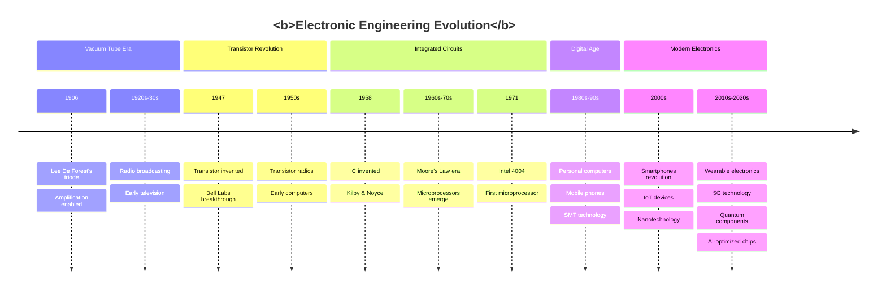

```mermaid
timeline
    title <b>Electronic Engineering Evolution</b>
    
    section Vacuum Tube Era
        1906  : Lee De Forest's triode
              : Amplification enabled
        1920s-30s : Radio broadcasting
                  : Early television
    
    section Transistor Revolution
        1947  : Transistor invented
              : Bell Labs breakthrough
        1950s : Transistor radios
              : Early computers
    
    section Integrated Circuits
        1958  : IC invented
              : Kilby & Noyce
        1960s-70s : Moore's Law era
                  : Microprocessors emerge
        1971  : Intel 4004
              : First microprocessor
    
    section Digital Age
        1980s-90s : Personal computers
                  : Mobile phones
                  : SMT technology
    
    section Modern Electronics
        2000s : Smartphones revolution
              : IoT devices
              : Nanotechnology
        2010s-2020s : Wearable electronics
                    : 5G technology
                    : Quantum components
                    : AI-optimized chips
```
