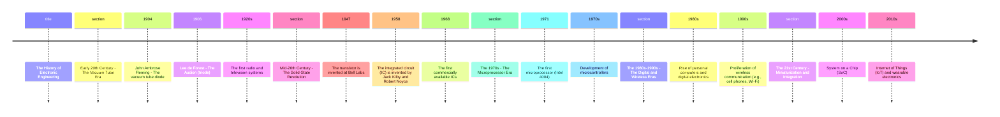

```mermaid
timeline
    title: The History of Electronic Engineering
    section: Early 20th Century - The Vacuum Tube Era
        1904: John Ambrose Fleming - The vacuum tube diode
        1906: Lee de Forest - The Audion (triode)
        1920s: The first radio and television systems
    section: Mid-20th Century - The Solid-State Revolution
        1947: The transistor is invented at Bell Labs
        1958: The integrated circuit (IC) is invented by Jack Kilby and Robert Noyce
        1968: The first commercially available ICs
    section: The 1970s - The Microprocessor Era
        1971: The first microprocessor (Intel 4004)
        1970s: Development of microcontrollers
    section: The 1980s-1990s - The Digital and Wireless Eras
        1980s: Rise of personal computers and digital electronics
        1990s: Proliferation of wireless communication (e.g., cell phones, Wi-Fi)
    section: The 21st Century - Miniaturization and Integration
        2000s: System on a Chip (SoC)
        2010s: Internet of Things (IoT) and wearable electronics
```
