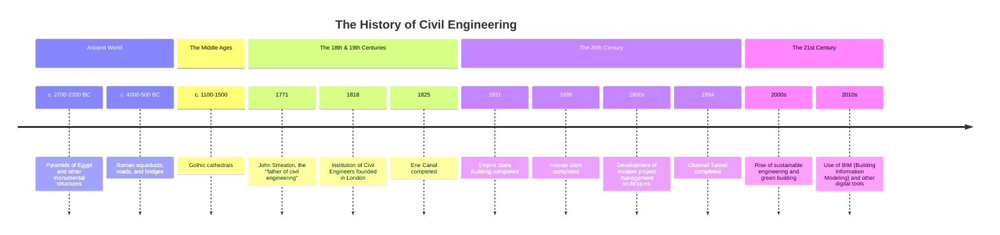

```mermaid
timeline
    title The History of Civil Engineering
    section Ancient World
        c. 2700-2200 BC : Pyramids of Egypt and other monumental structures
        c. 4000-500 BC : Roman aqueducts, roads, and bridges
    section The Middle Ages
        c. 1100-1500 : Gothic cathedrals
    section The 18th & 19th Centuries
        1771 : John Smeaton, the "father of civil engineering"
        1818 : Institution of Civil Engineers founded in London
        1825 : Erie Canal completed
    section The 20th Century
        1931 : Empire State Building completed
        1936 : Hoover Dam completed
        1950s : Development of modern project management techniques
        1994 : Channel Tunnel completed
    section The 21st Century
        2000s : Rise of sustainable engineering and green building
        2010s : Use of BIM (Building Information Modeling) and other digital tools
```
