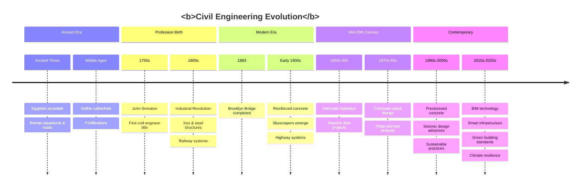

```mermaid
timeline
    title <b>Civil Engineering Evolution</b>
    
    section Ancient Era
        Ancient Times : Egyptian pyramids
                      : Roman aqueducts & roads
        Middle Ages : Gothic cathedrals
                    : Fortifications
    
    section Profession Birth
        1750s : John Smeaton
              : First civil engineer title
        1800s : Industrial Revolution
              : Iron & steel structures
              : Railway systems
    
    section Modern Era
        1883  : Brooklyn Bridge completed
        Early 1900s : Reinforced concrete
                    : Skyscrapers emerge
                    : Highway systems
    
    section Mid-20th Century
        1950s-60s : Interstate highways
                  : Massive dam projects
        1970s-80s : Computer-aided design
                  : Finite element analysis
    
    section Contemporary
        1990s-2000s : Prestressed concrete
                    : Seismic design advances
                    : Sustainable practices
        2010s-2020s : BIM technology
                    : Smart infrastructure
                    : Green building standards
                    : Climate resilience
```
