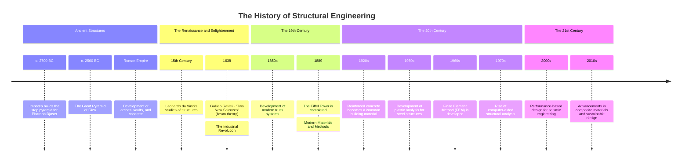

```mermaid
timeline
    title The History of Structural Engineering
    section Ancient Structures
        c. 2700 BC : Imhotep builds the step pyramid for Pharaoh Djoser
        c. 2560 BC : The Great Pyramid of Giza
        Roman Empire : Development of arches, vaults, and concrete
    section The Renaissance and Enlightenment
        15th Century : Leonardo da Vinci's studies of structures
        1638 : Galileo Galilei - "Two New Sciences" (beam theory)
    section The 19th Century: The Industrial Revolution
        1850s : Development of modern truss systems
        1889 : The Eiffel Tower is completed
    section The 20th Century: Modern Materials and Methods
        1920s : Reinforced concrete becomes a common building material
        1950s : Development of plastic analysis for steel structures
        1960s : Finite Element Method (FEM) is developed
        1970s : Rise of computer-aided structural analysis
    section The 21st Century
        2000s : Performance-based design for seismic engineering
        2010s : Advancements in composite materials and sustainable design
```
