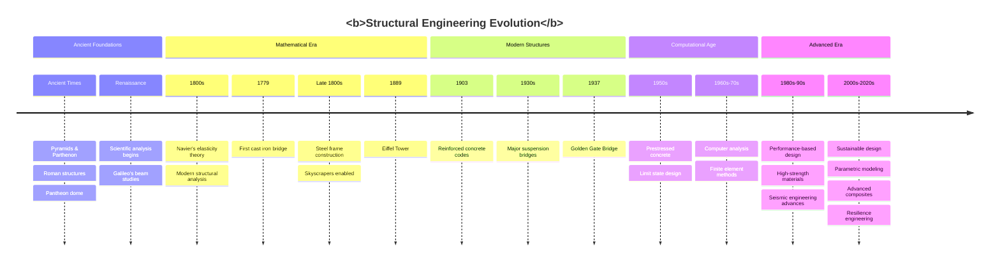

```mermaid
timeline
    title <b>Structural Engineering Evolution</b>
    
    section Ancient Foundations
        Ancient Times : Pyramids & Parthenon
                      : Roman structures
                      : Pantheon dome
        Renaissance : Scientific analysis begins
                    : Galileo's beam studies
    
    section Mathematical Era
        1800s : Navier's elasticity theory
              : Modern structural analysis
        1779  : First cast iron bridge
        Late 1800s : Steel frame construction
                   : Skyscrapers enabled
        1889  : Eiffel Tower
    
    section Modern Structures
        1903  : Reinforced concrete codes
        1930s : Major suspension bridges
        1937  : Golden Gate Bridge
    
    section Computational Age
        1950s : Prestressed concrete
              : Limit state design
        1960s-70s : Computer analysis
                  : Finite element methods
    
    section Advanced Era
        1980s-90s : Performance-based design
                  : High-strength materials
                  : Seismic engineering advances
        2000s-2020s : Sustainable design
                    : Parametric modeling
                    : Advanced composites
                    : Resilience engineering
```
