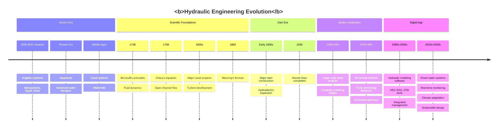

```mermaid
timeline
    title <b>Hydraulic Engineering Evolution</b>
    
    section Ancient Era
        3000 BCE onwards : Irrigation systems
                         : Mesopotamia, Egypt, Indus
        Roman Era : Aqueducts
                  : Advanced water transport
        Middle Ages : Canal systems
                    : Watermills
    
    section Scientific Foundations
        1738  : Bernoulli's principles
              : Fluid dynamics
        1768  : Chézy's equation
              : Open channel flow
        1800s : Major canal projects
              : Turbine development
        1889  : Manning's formula
    
    section Dam Era
        Early 1900s : Major dam construction
                    : Hydroelectric expansion
        1936  : Hoover Dam completed
    
    section Modern Hydraulics
        1950s-60s : Large-scale water projects
                  : Computer modeling begins
        1970s-80s : Numerical methods
                  : Pump technology advances
                  : Environmental focus
    
    section Digital Age
        1990s-2000s : Hydraulic modeling software
                    : HEC-RAS, CFD tools
                    : Integrated management
        2010s-2020s : Smart water systems
                    : Real-time monitoring
                    : Climate adaptation
                    : Sustainable design
```
