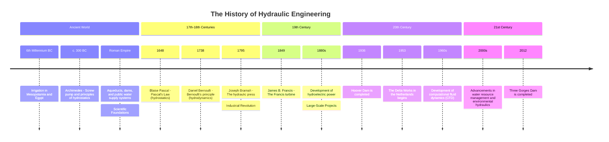

```mermaid
timeline
    title The History of Hydraulic Engineering
    section Ancient World
        6th Millennium BC : Irrigation in Mesopotamia and Egypt
        c. 300 BC : Archimedes - Screw pump and principles of hydrostatics
        Roman Empire : Aqueducts, dams, and public water supply systems
    section 17th-18th Centuries: Scientific Foundations
        1648 : Blaise Pascal - Pascal's Law (hydrostatics)
        1738 : Daniel Bernoulli - Bernoulli's principle (hydrodynamics)
        1795 : Joseph Bramah - The hydraulic press
    section 19th Century: Industrial Revolution
        1849 : James B. Francis - The Francis turbine
        1880s : Development of hydroelectric power
    section 20th Century: Large-Scale Projects
        1936 : Hoover Dam is completed
        1953 : The Delta Works in the Netherlands begins
        1960s : Development of computational fluid dynamics (CFD)
    section 21st Century
        2000s : Advancements in water resource management and environmental hydraulics
        2012 : Three Gorges Dam is completed
```
