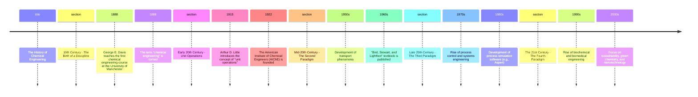

```mermaid
timeline
    title: The History of Chemical Engineering
    section: 19th Century - The Birth of a Discipline
        1888: George E. Davis teaches the first chemical engineering course at the University of Manchester
        1888: The term "chemical engineering" is coined
    section: Early 20th Century - Unit Operations
        1915: Arthur D. Little introduces the concept of "unit operations"
        1922: The American Institute of Chemical Engineers (AIChE) is founded
    section: Mid-20th Century - The Second Paradigm
        1950s: Development of transport phenomena
        1960s: "Bird, Stewart, and Lightfoot" textbook is published
    section: Late 20th Century - The Third Paradigm
        1970s: Rise of process control and systems engineering
        1980s: Development of process simulation software (e.g., Aspen)
    section: The 21st Century - The Fourth Paradigm
        1990s: Rise of biochemical and biomedical engineering
        2000s: Focus on sustainability, green chemistry, and nanotechnology
```
