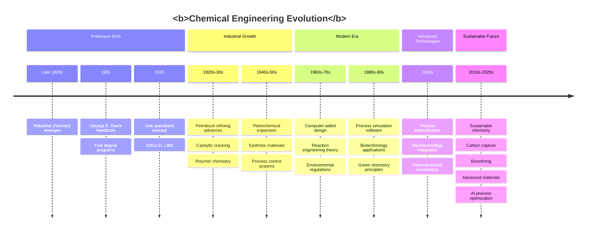

```mermaid
timeline
    title <b>Chemical Engineering Evolution</b>
    
    section Profession Birth
        Late 1800s : Industrial chemistry emerges
        1901  : George E. Davis handbook
              : First degree programs
        1915  : Unit operations concept
              : Arthur D. Little
    
    section Industrial Growth
        1920s-30s : Petroleum refining advances
                  : Catalytic cracking
                  : Polymer chemistry
        1940s-50s : Petrochemical expansion
                  : Synthetic materials
                  : Process control systems
    
    section Modern Era
        1960s-70s : Computer-aided design
                  : Reaction engineering theory
                  : Environmental regulations
        1980s-90s : Process simulation software
                  : Biotechnology applications
                  : Green chemistry principles
    
    section Advanced Technologies
        2000s : Process intensification
              : Nanotechnology integration
              : Pharmaceutical innovations
    
    section Sustainable Future
        2010s-2020s : Sustainable chemistry
                    : Carbon capture
                    : Biorefining
                    : Advanced materials
                    : AI process optimization
```
