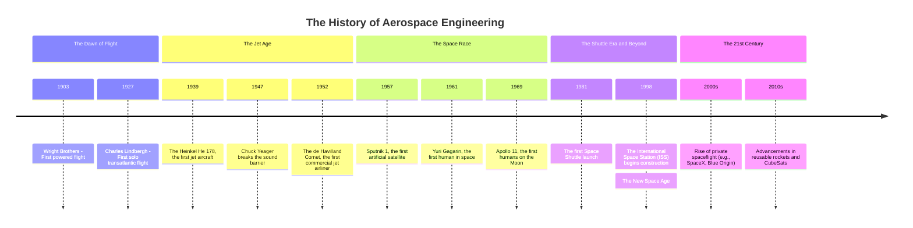

```mermaid
timeline
    title The History of Aerospace Engineering
    section The Dawn of Flight
        1903 : Wright Brothers - First powered flight
        1927 : Charles Lindbergh - First solo transatlantic flight
    section The Jet Age
        1939 : The Heinkel He 178, the first jet aircraft
        1947 : Chuck Yeager breaks the sound barrier
        1952 : The de Havilland Comet, the first commercial jet airliner
    section The Space Race
        1957 : Sputnik 1, the first artificial satellite
        1961 : Yuri Gagarin, the first human in space
        1969 : Apollo 11, the first humans on the Moon
    section The Shuttle Era and Beyond
        1981 : The first Space Shuttle launch
        1998 : The International Space Station (ISS) begins construction
    section The 21st Century: The New Space Age
        2000s : Rise of private spaceflight (e.g., SpaceX, Blue Origin)
        2010s : Advancements in reusable rockets and CubeSats
```
