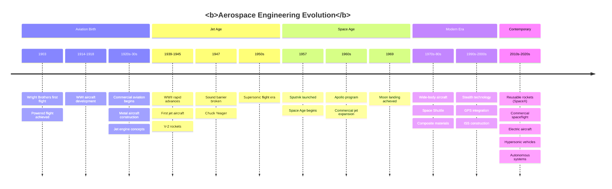

```mermaid
timeline
    title <b>Aerospace Engineering Evolution</b>
    
    section Aviation Birth
        1903  : Wright Brothers first flight
              : Powered flight achieved
        1914-1918 : WWI aircraft development
        1920s-30s : Commercial aviation begins
                  : Metal aircraft construction
                  : Jet engine concepts
    
    section Jet Age
        1939-1945 : WWII rapid advances
                  : First jet aircraft
                  : V-2 rockets
        1947  : Sound barrier broken
              : Chuck Yeager
        1950s : Supersonic flight era
    
    section Space Age
        1957  : Sputnik launched
              : Space Age begins
        1960s : Apollo program
              : Commercial jet expansion
        1969  : Moon landing achieved
    
    section Modern Era
        1970s-80s : Wide-body aircraft
                  : Space Shuttle
                  : Composite materials
        1990s-2000s : Stealth technology
                    : GPS integration
                    : ISS construction
    
    section Contemporary
        2010s-2020s : Reusable rockets (SpaceX)
                    : Commercial spaceflight
                    : Electric aircraft
                    : Hypersonic vehicles
                    : Autonomous systems
```
