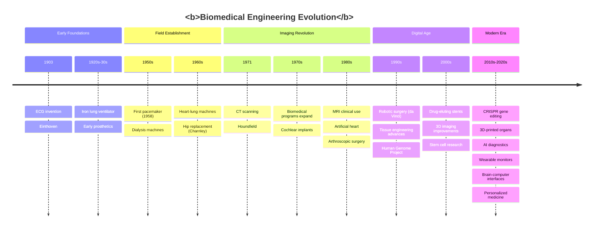

```mermaid
timeline
    title <b>Biomedical Engineering Evolution</b>
    
    section Early Foundations
        1903  : ECG invention
              : Einthoven
        1920s-30s : Iron lung ventilator
                  : Early prosthetics
    
    section Field Establishment
        1950s : First pacemaker (1958)
              : Dialysis machines
        1960s : Heart-lung machines
              : Hip replacement (Charnley)
    
    section Imaging Revolution
        1971  : CT scanning
              : Hounsfield
        1970s : Biomedical programs expand
              : Cochlear implants
        1980s : MRI clinical use
              : Artificial heart
              : Arthroscopic surgery
    
    section Digital Age
        1990s : Robotic surgery (da Vinci)
              : Tissue engineering advances
              : Human Genome Project
        2000s : Drug-eluting stents
              : 3D imaging improvements
              : Stem cell research
    
    section Modern Era
        2010s-2020s : CRISPR gene editing
                    : 3D-printed organs
                    : AI diagnostics
                    : Wearable monitors
                    : Brain-computer interfaces
                    : Personalized medicine
```
