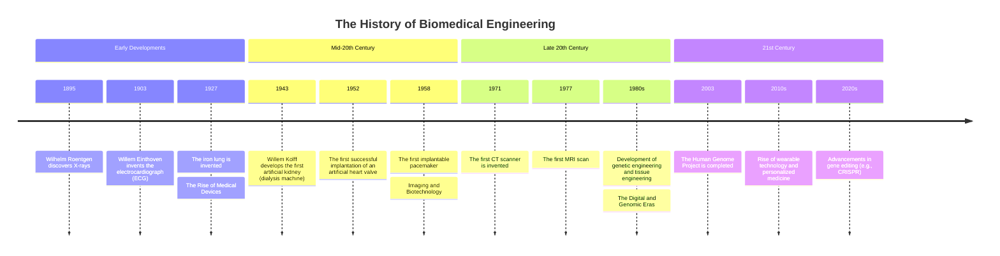

```mermaid
timeline
    title The History of Biomedical Engineering
    section Early Developments
        1895 : Wilhelm Roentgen discovers X-rays
        1903 : Willem Einthoven invents the electrocardiograph (ECG)
        1927 : The iron lung is invented
    section Mid-20th Century: The Rise of Medical Devices
        1943 : Willem Kolff develops the first artificial kidney (dialysis machine)
        1952 : The first successful implantation of an artificial heart valve
        1958 : The first implantable pacemaker
    section Late 20th Century: Imaging and Biotechnology
        1971 : The first CT scanner is invented
        1977 : The first MRI scan
        1980s : Development of genetic engineering and tissue engineering
    section 21st Century: The Digital and Genomic Eras
        2003 : The Human Genome Project is completed
        2010s : Rise of wearable technology and personalized medicine
        2020s : Advancements in gene editing (e.g., CRISPR)
```
