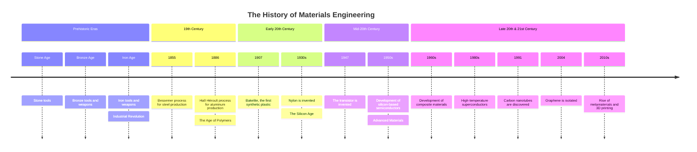

```mermaid
timeline
    title The History of Materials Engineering
    section Prehistoric Eras
        Stone Age : Stone tools
        Bronze Age : Bronze tools and weapons
        Iron Age : Iron tools and weapons
    section 19th Century: Industrial Revolution
        1855 : Bessemer process for steel production
        1886 : Hall-Héroult process for aluminum production
    section Early 20th Century: The Age of Polymers
        1907 : Bakelite, the first synthetic plastic
        1930s : Nylon is invented
    section Mid-20th Century: The Silicon Age
        1947 : The transistor is invented
        1950s : Development of silicon-based semiconductors
    section Late 20th & 21st Century: Advanced Materials
        1960s : Development of composite materials
        1980s : High-temperature superconductors
        1991 : Carbon nanotubes are discovered
        2004 : Graphene is isolated
        2010s : Rise of metamaterials and 3D printing
```
