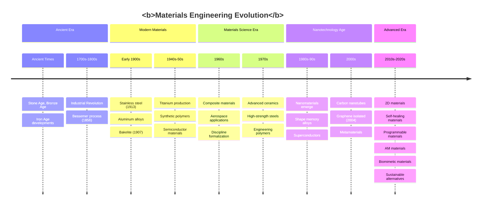

```mermaid
timeline
    title <b>Materials Engineering Evolution</b>
    
    section Ancient Era
        Ancient Times : Stone Age, Bronze Age
                      : Iron Age developments
        1700s-1800s : Industrial Revolution
                    : Bessemer process (1856)
    
    section Modern Materials
        Early 1900s : Stainless steel (1913)
                    : Aluminum alloys
                    : Bakelite (1907)
        1940s-50s : Titanium production
                  : Synthetic polymers
                  : Semiconductor materials
    
    section Materials Science Era
        1960s : Composite materials
              : Aerospace applications
              : Discipline formalization
        1970s : Advanced ceramics
              : High-strength steels
              : Engineering polymers
    
    section Nanotechnology Age
        1980s-90s : Nanomaterials emerge
                  : Shape memory alloys
                  : Superconductors
        2000s : Carbon nanotubes
              : Graphene isolated (2004)
              : Metamaterials
    
    section Advanced Era
        2010s-2020s : 2D materials
                    : Self-healing materials
                    : Programmable materials
                    : AM materials
                    : Biomimetic materials
                    : Sustainable alternatives
```
