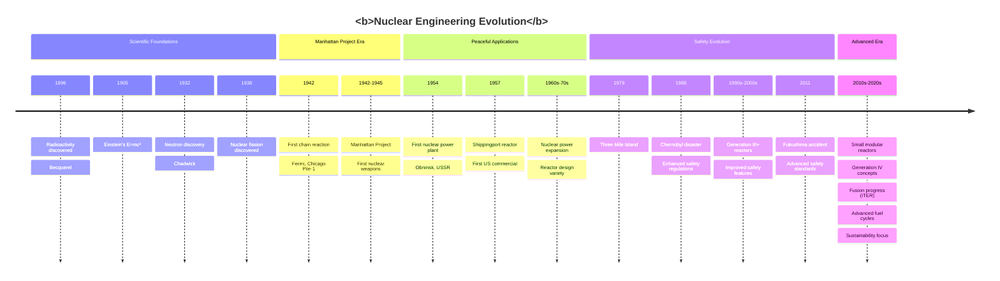

```mermaid
timeline
    title <b>Nuclear Engineering Evolution</b>
    
    section Scientific Foundations
        1896  : Radioactivity discovered
              : Becquerel
        1905  : Einstein's E=mc²
        1932  : Neutron discovery
              : Chadwick
        1938  : Nuclear fission discovered
    
    section Manhattan Project Era
        1942  : First chain reaction
              : Fermi, Chicago Pile-1
        1942-1945 : Manhattan Project
                  : First nuclear weapons
    
    section Peaceful Applications
        1954  : First nuclear power plant
              : Obninsk, USSR
        1957  : Shippingport reactor
              : First US commercial
        1960s-70s : Nuclear power expansion
                  : Reactor design variety
    
    section Safety Evolution
        1979  : Three Mile Island
        1986  : Chernobyl disaster
              : Enhanced safety regulations
        1990s-2000s : Generation III+ reactors
                    : Improved safety features
        2011  : Fukushima accident
              : Advanced safety standards
    
    section Advanced Era
        2010s-2020s : Small modular reactors
                    : Generation IV concepts
                    : Fusion progress (ITER)
                    : Advanced fuel cycles
                    : Sustainability focus
```
