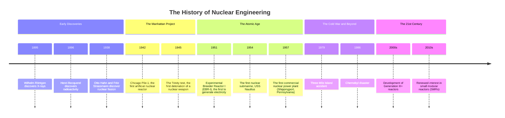

```mermaid
timeline
    title The History of Nuclear Engineering
    section Early Discoveries
        1895 : Wilhelm Röntgen discovers X-rays
        1896 : Henri Becquerel discovers radioactivity
        1938 : Otto Hahn and Fritz Strassmann discover nuclear fission
    section The Manhattan Project
        1942 : Chicago Pile-1, the first artificial nuclear reactor
        1945 : The Trinity test, the first detonation of a nuclear weapon
    section The Atomic Age
        1951 : Experimental Breeder Reactor I (EBR-I), the first to generate electricity
        1954 : The first nuclear submarine, USS Nautilus
        1957 : The first commercial nuclear power plant (Shippingport, Pennsylvania)
    section The Cold War and Beyond
        1979 : Three Mile Island accident
        1986 : Chernobyl disaster
    section The 21st Century
        2000s : Development of Generation III+ reactors
        2010s : Renewed interest in small modular reactors (SMRs)
```
