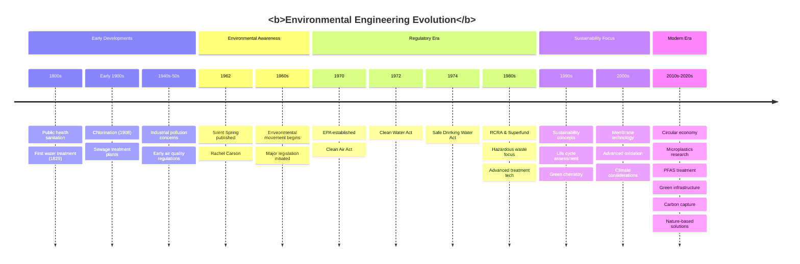

```mermaid
timeline
    title <b>Environmental Engineering Evolution</b>
    
    section Early Developments
        1800s : Public health sanitation
              : First water treatment (1829)
        Early 1900s : Chlorination (1908)
                    : Sewage treatment plants
        1940s-50s : Industrial pollution concerns
                  : Early air quality regulations
    
    section Environmental Awareness
        1962  : Silent Spring published
              : Rachel Carson
        1960s : Environmental movement begins
              : Major legislation initiated
    
    section Regulatory Era
        1970  : EPA established
              : Clean Air Act
        1972  : Clean Water Act
        1974  : Safe Drinking Water Act
        1980s : RCRA & Superfund
              : Hazardous waste focus
              : Advanced treatment tech
    
    section Sustainability Focus
        1990s : Sustainability concepts
              : Life cycle assessment
              : Green chemistry
        2000s : Membrane technology
              : Advanced oxidation
              : Climate considerations
    
    section Modern Era
        2010s-2020s : Circular economy
                    : Microplastics research
                    : PFAS treatment
                    : Green infrastructure
                    : Carbon capture
                    : Nature-based solutions
```
