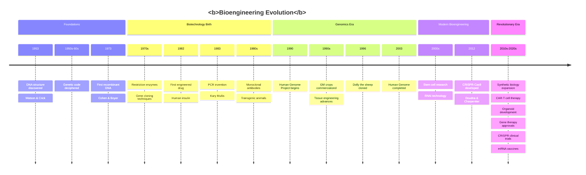

```mermaid
timeline
    title <b>Bioengineering Evolution</b>
    
    section Foundations
        1953  : DNA structure discovered
              : Watson & Crick
        1950s-60s : Genetic code deciphered
        1973  : First recombinant DNA
              : Cohen & Boyer
    
    section Biotechnology Birth
        1970s : Restriction enzymes
              : Gene cloning techniques
        1982  : First engineered drug
              : Human insulin
        1983  : PCR invention
              : Kary Mullis
        1980s : Monoclonal antibodies
              : Transgenic animals
    
    section Genomics Era
        1990  : Human Genome Project begins
        1990s : GM crops commercialized
              : Tissue engineering advances
        1996  : Dolly the sheep cloned
        2003  : Human Genome completed
    
    section Modern Bioengineering
        2000s : Stem cell research
              : RNAi technology
        2012  : CRISPR-Cas9 developed
              : Doudna & Charpentier
    
    section Revolutionary Era
        2010s-2020s : Synthetic biology expansion
                    : CAR-T cell therapy
                    : Organoid development
                    : Gene therapy approvals
                    : CRISPR clinical trials
                    : mRNA vaccines
```
