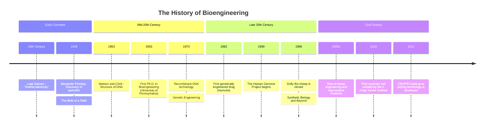

```mermaid
timeline
    title The History of Bioengineering
    section Early Concepts
        18th Century : Luigi Galvani - "Animal electricity"
        1928 : Alexander Fleming - Discovery of penicillin
    section Mid-20th Century: The Birth of a Field
        1953 : Watson and Crick - Structure of DNA
        1953 : First Ph.D. in Bioengineering (University of Pennsylvania)
        1973 : Recombinant DNA technology
    section Late 20th Century: Genetic Engineering
        1982 : First genetically engineered drug (Humulin)
        1990 : The Human Genome Project begins
        1996 : Dolly the sheep is cloned
    section 21st Century: Synthetic Biology and Beyond
        2000s : Rise of tissue engineering and regenerative medicine
        2010 : First synthetic cell created by the J. Craig Venter Institute
        2012 : CRISPR-Cas9 gene editing technology is developed
```
