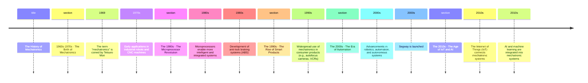

```mermaid
timeline
    title: The History of Mechatronics
    section: 1960s-1970s - The Birth of Mechatronics
        1969: The term "mechatronics" is coined by Tetsuro Mori
        1970s: Early applications in industrial robots and CNC machines
    section: The 1980s - The Microprocessor Revolution
        1980s: Microprocessors enable more intelligent and integrated systems
        1980s: Development of anti-lock braking systems (ABS)
    section: The 1990s - The Rise of Smart Products
        1990s: Widespread use of mechatronics in consumer products (e.g., autofocus cameras, VCRs)
    section: The 2000s - The Era of Automation
        2000s: Advancements in robotics, automation, and autonomous systems
        2000s: Segway is launched
    section: The 2010s - The Age of IoT and AI
        2010s: The Internet of Things (IoT) connects mechatronic systems
        2010s: AI and machine learning are integrated into mechatronic systems
```
