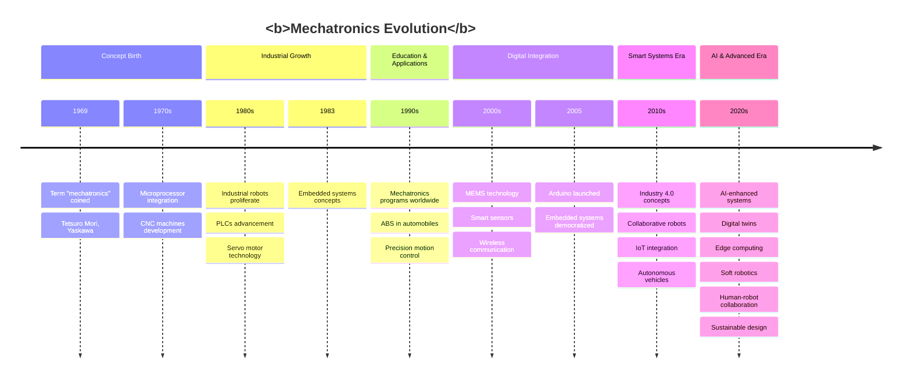

```mermaid
timeline
    title <b>Mechatronics Evolution</b>
    
    section Concept Birth
        1969  : Term "mechatronics" coined
              : Tetsuro Mori, Yaskawa
        1970s : Microprocessor integration
              : CNC machines development
    
    section Industrial Growth
        1980s : Industrial robots proliferate
              : PLCs advancement
              : Servo motor technology
        1983  : Embedded systems concepts
    
    section Education & Applications
        1990s : Mechatronics programs worldwide
              : ABS in automobiles
              : Precision motion control
    
    section Digital Integration
        2000s : MEMS technology
              : Smart sensors
              : Wireless communication
        2005  : Arduino launched
              : Embedded systems democratized
    
    section Smart Systems Era
        2010s : Industry 4.0 concepts
              : Collaborative robots
              : IoT integration
              : Autonomous vehicles
    
    section AI & Advanced Era
        2020s : AI-enhanced systems
              : Digital twins
              : Edge computing
              : Soft robotics
              : Human-robot collaboration
              : Sustainable design
```
