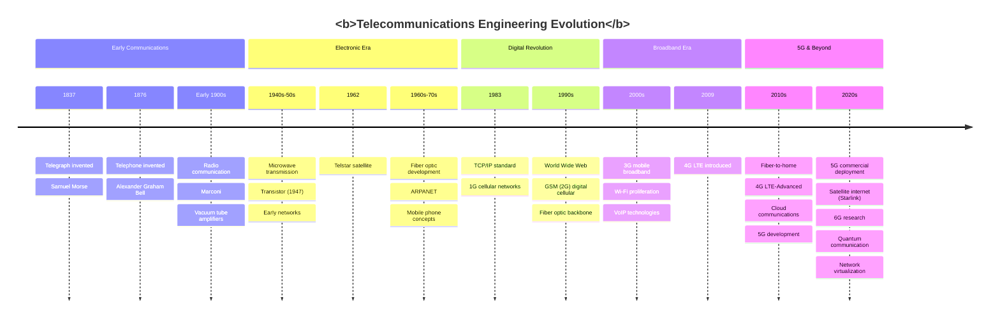

```mermaid
timeline
    title <b>Telecommunications Engineering Evolution</b>
    
    section Early Communications
        1837  : Telegraph invented
              : Samuel Morse
        1876  : Telephone invented
              : Alexander Graham Bell
        Early 1900s : Radio communication
                    : Marconi
                    : Vacuum tube amplifiers
    
    section Electronic Era
        1940s-50s : Microwave transmission
                  : Transistor (1947)
                  : Early networks
        1962  : Telstar satellite
        1960s-70s : Fiber optic development
                  : ARPANET
                  : Mobile phone concepts
    
    section Digital Revolution
        1983  : TCP/IP standard
              : 1G cellular networks
        1990s : World Wide Web
              : GSM (2G) digital cellular
              : Fiber optic backbone
    
    section Broadband Era
        2000s : 3G mobile broadband
              : Wi-Fi proliferation
              : VoIP technologies
        2009  : 4G LTE introduced
    
    section 5G & Beyond
        2010s : Fiber-to-home
              : 4G LTE-Advanced
              : Cloud communications
              : 5G development
        2020s : 5G commercial deployment
              : Satellite internet (Starlink)
              : 6G research
              : Quantum communication
              : Network virtualization
```
