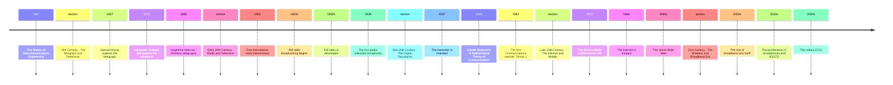

```mermaid
timeline
    title: The History of Telecommunications Engineering
    section: 19th Century - The Telegraph and Telephone
        1837: Samuel Morse patents the telegraph
        1876: Alexander Graham Bell patents the telephone
        1895: Guglielmo Marconi - Wireless telegraphy
    section: Early 20th Century - Radio and Television
        1901: First transatlantic radio transmission
        1920s: AM radio broadcasting begins
        1930s: FM radio is developed
        1936: The first public television broadcasts
    section: Mid-20th Century - The Digital Revolution
        1947: The transistor is invented
        1948: Claude Shannon's "A Mathematical Theory of Communication"
        1962: The first communications satellite, Telstar 1
    section: Late 20th Century - The Internet and Mobile
        1973: The first handheld mobile phone call
        1983: The Internet is created
        1990s: The World Wide Web
    section: 21st Century - The Wireless and Broadband Era
        2000s: The rise of broadband and VoIP
        2010s: The proliferation of smartphones and 4G/LTE
        2020s: The rollout of 5G
```
