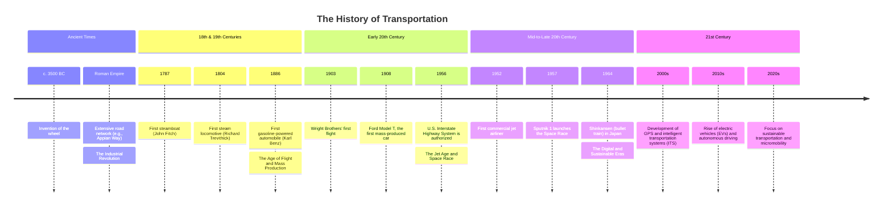

```mermaid
timeline
    title The History of Transportation
    section Ancient Times
        c. 3500 BC : Invention of the wheel
        Roman Empire : Extensive road network (e.g., Appian Way)
    section 18th & 19th Centuries: The Industrial Revolution
        1787 : First steamboat (John Fitch)
        1804 : First steam locomotive (Richard Trevithick)
        1886 : First gasoline-powered automobile (Karl Benz)
    section Early 20th Century: The Age of Flight and Mass Production
        1903 : Wright Brothers' first flight
        1908 : Ford Model T, the first mass-produced car
        1956 : U.S. Interstate Highway System is authorized
    section Mid-to-Late 20th Century: The Jet Age and Space Race
        1952 : First commercial jet airliner
        1957 : Sputnik 1 launches the Space Race
        1964 : Shinkansen (bullet train) in Japan
    section 21st Century: The Digital and Sustainable Eras
        2000s : Development of GPS and intelligent transportation systems (ITS)
        2010s : Rise of electric vehicles (EVs) and autonomous driving
        2020s : Focus on sustainable transportation and micromobility
```
