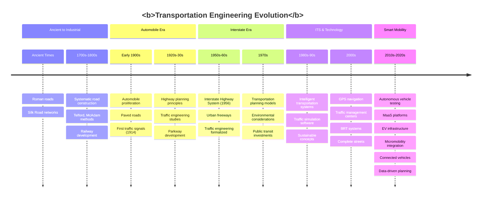

```mermaid
timeline
    title <b>Transportation Engineering Evolution</b>
    
    section Ancient to Industrial
        Ancient Times : Roman roads
                      : Silk Road networks
        1700s-1800s : Systematic road construction
                    : Telford, McAdam methods
                    : Railway development
    
    section Automobile Era
        Early 1900s : Automobile proliferation
                    : Paved roads
                    : First traffic signals (1914)
        1920s-30s : Highway planning principles
                  : Traffic engineering studies
                  : Parkway development
    
    section Interstate Era
        1950s-60s : Interstate Highway System (1956)
                  : Urban freeways
                  : Traffic engineering formalized
        1970s : Transportation planning models
              : Environmental considerations
              : Public transit investments
    
    section ITS & Technology
        1980s-90s : Intelligent transportation systems
                  : Traffic simulation software
                  : Sustainable concepts
        2000s : GPS navigation
              : Traffic management centers
              : BRT systems
              : Complete streets
    
    section Smart Mobility
        2010s-2020s : Autonomous vehicle testing
                    : MaaS platforms
                    : EV infrastructure
                    : Micromobility integration
                    : Connected vehicles
                    : Data-driven planning
```
