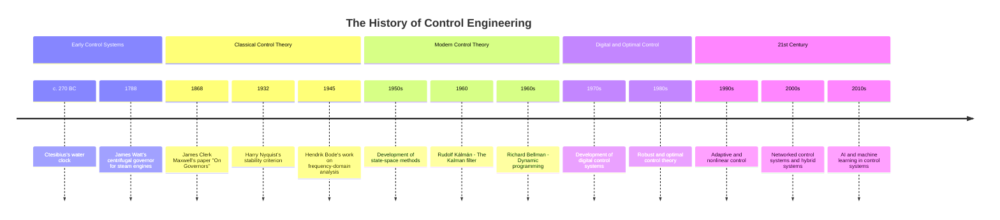

```mermaid
timeline
    title The History of Control Engineering
    section Early Control Systems
        c. 270 BC : Ctesibius's water clock
        1788 : James Watt's centrifugal governor for steam engines
    section Classical Control Theory
        1868 : James Clerk Maxwell's paper "On Governors"
        1932 : Harry Nyquist's stability criterion
        1945 : Hendrik Bode's work on frequency-domain analysis
    section Modern Control Theory
        1950s : Development of state-space methods
        1960 : Rudolf Kálmán - The Kalman filter
        1960s : Richard Bellman - Dynamic programming
    section Digital and Optimal Control
        1970s : Development of digital control systems
        1980s : Robust and optimal control theory
    section 21st Century
        1990s : Adaptive and nonlinear control
        2000s : Networked control systems and hybrid systems
        2010s : AI and machine learning in control systems
```
