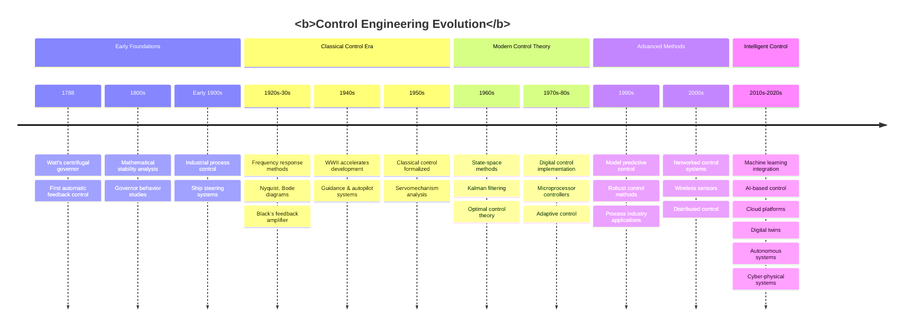

```mermaid
timeline
    title <b>Control Engineering Evolution</b>
    
    section Early Foundations
        1788  : Watt's centrifugal governor
              : First automatic feedback control
        1800s : Mathematical stability analysis
              : Governor behavior studies
        Early 1900s : Industrial process control
                    : Ship steering systems
    
    section Classical Control Era
        1920s-30s : Frequency response methods
                  : Nyquist, Bode diagrams
                  : Black's feedback amplifier
        1940s : WWII accelerates development
              : Guidance & autopilot systems
        1950s : Classical control formalized
              : Servomechanism analysis
    
    section Modern Control Theory
        1960s : State-space methods
              : Kalman filtering
              : Optimal control theory
        1970s-80s : Digital control implementation
                  : Microprocessor controllers
                  : Adaptive control
    
    section Advanced Methods
        1990s : Model predictive control
              : Robust control methods
              : Process industry applications
        2000s : Networked control systems
              : Wireless sensors
              : Distributed control
    
    section Intelligent Control
        2010s-2020s : Machine learning integration
                    : AI-based control
                    : Cloud platforms
                    : Digital twins
                    : Autonomous systems
                    : Cyber-physical systems
```
