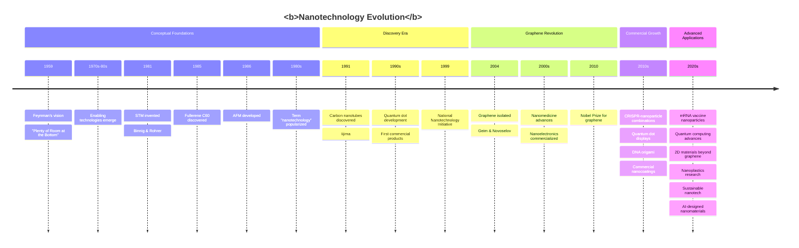

```mermaid
timeline
    title <b>Nanotechnology Evolution</b>
    
    section Conceptual Foundations
        1959  : Feynman's vision
              : "Plenty of Room at the Bottom"
        1970s-80s : Enabling technologies emerge
        1981  : STM invented
              : Binnig & Rohrer
        1985  : Fullerene C60 discovered
        1986  : AFM developed
        1980s : Term "nanotechnology" popularized
    
    section Discovery Era
        1991  : Carbon nanotubes discovered
              : Iijima
        1990s : Quantum dot development
              : First commercial products
        1999  : National Nanotechnology Initiative
    
    section Graphene Revolution
        2004  : Graphene isolated
              : Geim & Novoselov
        2000s : Nanomedicine advances
              : Nanoelectronics commercialized
        2010  : Nobel Prize for graphene
    
    section Commercial Growth
        2010s : CRISPR-nanoparticle combinations
              : Quantum dot displays
              : DNA origami
              : Commercial nanocoatings
    
    section Advanced Applications
        2020s : mRNA vaccine nanoparticles
              : Quantum computing advances
              : 2D materials beyond graphene
              : Nanoplastics research
              : Sustainable nanotech
              : AI-designed nanomaterials
```
