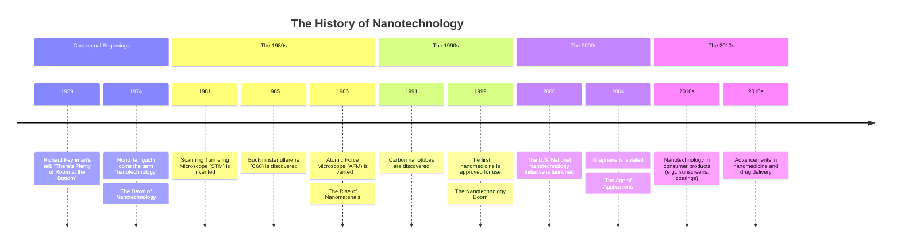

```mermaid
timeline
    title The History of Nanotechnology
    section Conceptual Beginnings
        1959 : Richard Feynman's talk "There's Plenty of Room at the Bottom"
        1974 : Norio Taniguchi coins the term "nanotechnology"
    section The 1980s: The Dawn of Nanotechnology
        1981 : Scanning Tunneling Microscope (STM) is invented
        1985 : Buckminsterfullerene (C60) is discovered
        1986 : Atomic Force Microscope (AFM) is invented
    section The 1990s: The Rise of Nanomaterials
        1991 : Carbon nanotubes are discovered
        1999 : The first nanomedicine is approved for use
    section The 2000s: The Nanotechnology Boom
        2000 : The U.S. National Nanotechnology Initiative is launched
        2004 : Graphene is isolated
    section The 2010s: The Age of Applications
        2010s : Nanotechnology in consumer products (e.g., sunscreens, coatings)
        2010s : Advancements in nanomedicine and drug delivery
```
