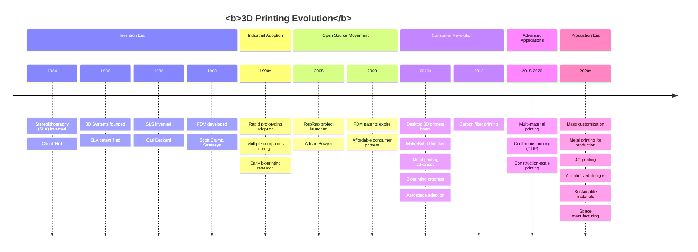

```mermaid
timeline
    title <b>3D Printing Evolution</b>
    
    section Invention Era
        1984  : Stereolithography (SLA) invented
              : Chuck Hull
        1986  : 3D Systems founded
              : SLA patent filed
        1988  : SLS invented
              : Carl Deckard
        1989  : FDM developed
              : Scott Crump, Stratasys
    
    section Industrial Adoption
        1990s : Rapid prototyping adoption
              : Multiple companies emerge
              : Early bioprinting research
    
    section Open Source Movement
        2005  : RepRap project launched
              : Adrian Bowyer
        2009  : FDM patents expire
              : Affordable consumer printers
    
    section Consumer Revolution
        2010s : Desktop 3D printers boom
              : MakerBot, Ultimaker
              : Metal printing advances
              : Bioprinting progress
              : Aerospace adoption
        2013  : Carbon fiber printing
    
    section Advanced Applications
        2015-2020 : Multi-material printing
                  : Continuous printing (CLIP)
                  : Construction-scale printing
    
    section Production Era
        2020s : Mass customization
              : Metal printing for production
              : 4D printing
              : AI-optimized designs
              : Sustainable materials
              : Space manufacturing
```
