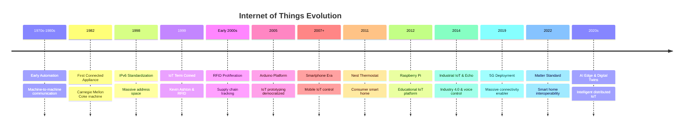

```mermaid
timeline
    title Internet of Things Evolution
    1970s-1980s : Early Automation
                : Machine-to-machine communication
    1982 : First Connected Appliance
         : Carnegie Mellon Coke machine
    1998 : IPv6 Standardization
         : Massive address space
    1999 : IoT Term Coined
         : Kevin Ashton & RFID
    Early 2000s : RFID Proliferation
                : Supply chain tracking
    2005 : Arduino Platform
         : IoT prototyping democratized
    2007+ : Smartphone Era
          : Mobile IoT control
    2011 : Nest Thermostat
         : Consumer smart home
    2012 : Raspberry Pi
         : Educational IoT platform
    2014 : Industrial IoT & Echo
         : Industry 4.0 & voice control
    2019 : 5G Deployment
         : Massive connectivity enabler
    2022 : Matter Standard
         : Smart home interoperability
    2020s : AI Edge & Digital Twins
          : Intelligent distributed IoT
```
