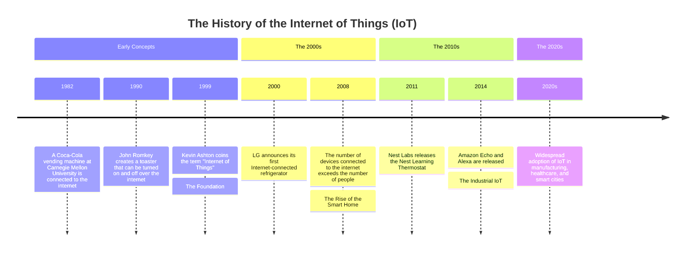

```mermaid
timeline
    title The History of the Internet of Things (IoT)
    section Early Concepts
        1982 : A Coca-Cola vending machine at Carnegie Mellon University is connected to the internet
        1990 : John Romkey creates a toaster that can be turned on and off over the internet
        1999 : Kevin Ashton coins the term "Internet of Things"
    section The 2000s: The Foundation
        2000 : LG announces its first Internet-connected refrigerator
        2008 : The number of devices connected to the internet exceeds the number of people
    section The 2010s: The Rise of the Smart Home
        2011 : Nest Labs releases the Nest Learning Thermostat
        2014 : Amazon Echo and Alexa are released
    section The 2020s: The Industrial IoT
        2020s : Widespread adoption of IoT in manufacturing, healthcare, and smart cities
```
