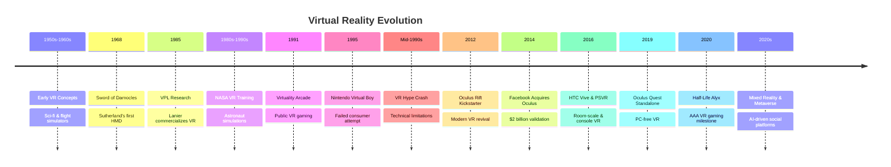

```mermaid
timeline
    title Virtual Reality Evolution
    1950s-1960s : Early VR Concepts
                : Sci-fi & flight simulators
    1968 : Sword of Damocles
         : Sutherland's first HMD
    1985 : VPL Research
         : Lanier commercializes VR
    1980s-1990s : NASA VR Training
                : Astronaut simulations
    1991 : Virtuality Arcade
         : Public VR gaming
    1995 : Nintendo Virtual Boy
         : Failed consumer attempt
    Mid-1990s : VR Hype Crash
              : Technical limitations
    2012 : Oculus Rift Kickstarter
         : Modern VR revival
    2014 : Facebook Acquires Oculus
         : $2 billion validation
    2016 : HTC Vive & PSVR
         : Room-scale & console VR
    2019 : Oculus Quest Standalone
         : PC-free VR
    2020 : Half-Life Alyx
         : AAA VR gaming milestone
    2020s : Mixed Reality & Metaverse
          : AI-driven social platforms
```
