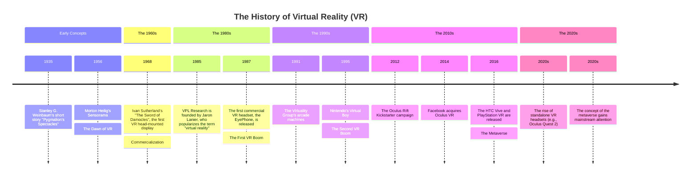

```mermaid
timeline
    title The History of Virtual Reality (VR)
    section Early Concepts
        1935 : Stanley G. Weinbaum's short story "Pygmalion's Spectacles"
        1956 : Morton Heilig's Sensorama
    section The 1960s: The Dawn of VR
        1968 : Ivan Sutherland's "The Sword of Damocles", the first VR head-mounted display
    section The 1980s: Commercialization
        1985 : VPL Research is founded by Jaron Lanier, who popularizes the term "virtual reality"
        1987 : The first commercial VR headset, the EyePhone, is released
    section The 1990s: The First VR Boom
        1991 : The Virtuality Group's arcade machines
        1995 : Nintendo's Virtual Boy
    section The 2010s: The Second VR Boom
        2012 : The Oculus Rift Kickstarter campaign
        2014 : Facebook acquires Oculus VR
        2016 : The HTC Vive and PlayStation VR are released
    section The 2020s: The Metaverse
        2020s : The rise of standalone VR headsets (e.g., Oculus Quest 2)
        2020s : The concept of the metaverse gains mainstream attention
```
