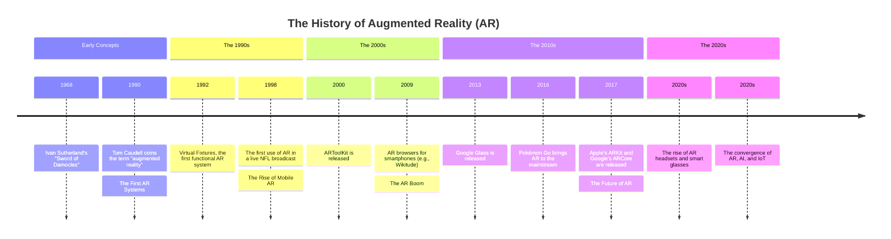

```mermaid
timeline
    title The History of Augmented Reality (AR)
    section Early Concepts
        1968 : Ivan Sutherland's "Sword of Damocles"
        1990 : Tom Caudell coins the term "augmented reality"
    section The 1990s: The First AR Systems
        1992 : Virtual Fixtures, the first functional AR system
        1998 : The first use of AR in a live NFL broadcast
    section The 2000s: The Rise of Mobile AR
        2000 : ARToolKit is released
        2009 : AR browsers for smartphones (e.g., Wikitude)
    section The 2010s: The AR Boom
        2013 : Google Glass is released
        2016 : Pokémon Go brings AR to the mainstream
        2017 : Apple's ARKit and Google's ARCore are released
    section The 2020s: The Future of AR
        2020s : The rise of AR headsets and smart glasses
        2020s : The convergence of AR, AI, and IoT
```
