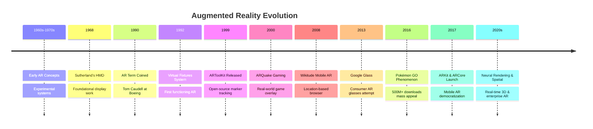

```mermaid
timeline
    title Augmented Reality Evolution
    1960s-1970s : Early AR Concepts
                : Experimental systems
    1968 : Sutherland's HMD
         : Foundational display work
    1990 : AR Term Coined
         : Tom Caudell at Boeing
    1992 : Virtual Fixtures System
         : First functioning AR
    1999 : ARToolKit Released
         : Open-source marker tracking
    2000 : ARQuake Gaming
         : Real-world game overlay
    2008 : Wikitude Mobile AR
         : Location-based browser
    2013 : Google Glass
         : Consumer AR glasses attempt
    2016 : Pokémon GO Phenomenon
         : 500M+ downloads mass appeal
    2017 : ARKit & ARCore Launch
         : Mobile AR democratization
    2020s : Neural Rendering & Spatial
          : Real-time 3D & enterprise AR
```
