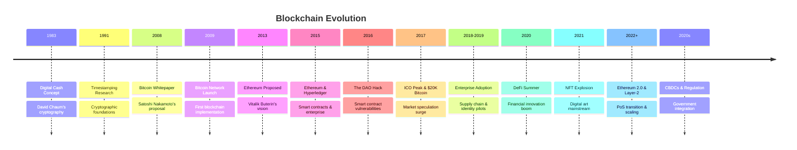

```mermaid
timeline
    title Blockchain Evolution
    1983 : Digital Cash Concept
         : David Chaum's cryptography
    1991 : Timestamping Research
         : Cryptographic foundations
    2008 : Bitcoin Whitepaper
         : Satoshi Nakamoto's proposal
    2009 : Bitcoin Network Launch
         : First blockchain implementation
    2013 : Ethereum Proposed
         : Vitalik Buterin's vision
    2015 : Ethereum & Hyperledger
         : Smart contracts & enterprise
    2016 : The DAO Hack
         : Smart contract vulnerabilities
    2017 : ICO Peak & $20K Bitcoin
         : Market speculation surge
    2018-2019 : Enterprise Adoption
              : Supply chain & identity pilots
    2020 : DeFi Summer
         : Financial innovation boom
    2021 : NFT Explosion
         : Digital art mainstream
    2022+ : Ethereum 2.0 & Layer-2
          : PoS transition & scaling
    2020s : CBDCs & Regulation
          : Government integration
```
