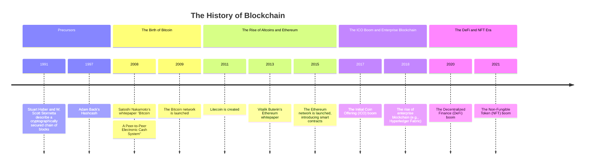

```mermaid
timeline
    title The History of Blockchain
    section Precursors
        1991 : Stuart Haber and W. Scott Stornetta describe a cryptographically secured chain of blocks
        1997 : Adam Back's Hashcash
    section The Birth of Bitcoin
        2008 : Satoshi Nakamoto's whitepaper "Bitcoin: A Peer-to-Peer Electronic Cash System"
        2009 : The Bitcoin network is launched
    section The Rise of Altcoins and Ethereum
        2011 : Litecoin is created
        2013 : Vitalik Buterin's Ethereum whitepaper
        2015 : The Ethereum network is launched, introducing smart contracts
    section The ICO Boom and Enterprise Blockchain
        2017 : The Initial Coin Offering (ICO) boom
        2018 : The rise of enterprise blockchain (e.g., Hyperledger Fabric)
    section The DeFi and NFT Era
        2020 : The Decentralized Finance (DeFi) boom
        2021 : The Non-Fungible Token (NFT) boom
```
