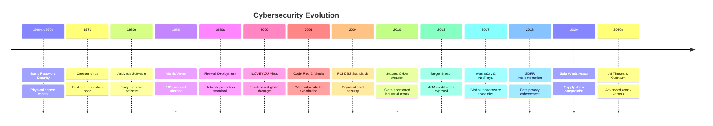

```mermaid
timeline
    title Cybersecurity Evolution
    1960s-1970s : Basic Password Security
                : Physical access control
    1971 : Creeper Virus
         : First self-replicating code
    1980s : Antivirus Software
          : Early malware defense
    1988 : Morris Worm
         : 10% internet infection
    1990s : Firewall Deployment
          : Network protection standard
    2000 : ILOVEYOU Virus
         : Email-based global damage
    2001 : Code Red & Nimda
         : Web vulnerability exploitation
    2004 : PCI DSS Standards
         : Payment card security
    2010 : Stuxnet Cyber Weapon
         : State-sponsored industrial attack
    2013 : Target Breach
         : 40M credit cards exposed
    2017 : WannaCry & NotPetya
         : Global ransomware epidemics
    2018 : GDPR Implementation
         : Data privacy enforcement
    2020 : SolarWinds Attack
         : Supply chain compromise
    2020s : AI Threats & Quantum
          : Advanced attack vectors
```
