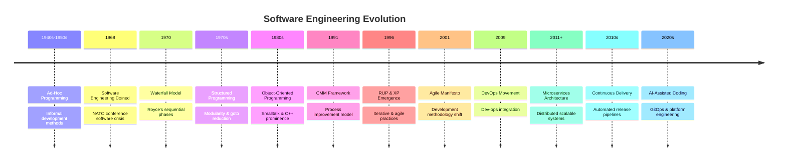

```mermaid
timeline
    title Software Engineering Evolution
    1940s-1950s : Ad-Hoc Programming
                : Informal development methods
    1968 : Software Engineering Coined
         : NATO conference software crisis
    1970 : Waterfall Model
         : Royce's sequential phases
    1970s : Structured Programming
          : Modularity & goto reduction
    1980s : Object-Oriented Programming
          : Smalltalk & C++ prominence
    1991 : CMM Framework
         : Process improvement model
    1996 : RUP & XP Emergence
         : Iterative & agile practices
    2001 : Agile Manifesto
         : Development methodology shift
    2009 : DevOps Movement
         : Dev-ops integration
    2011+ : Microservices Architecture
          : Distributed scalable systems
    2010s : Continuous Delivery
          : Automated release pipelines
    2020s : AI-Assisted Coding
          : GitOps & platform engineering
```
