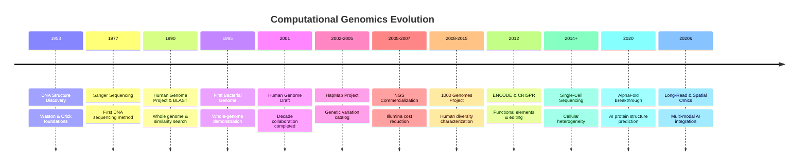

```mermaid
timeline
    title Computational Genomics Evolution
    1953 : DNA Structure Discovery
         : Watson & Crick foundations
    1977 : Sanger Sequencing
         : First DNA sequencing method
    1990 : Human Genome Project & BLAST
         : Whole genome & similarity search
    1995 : First Bacterial Genome
         : Whole-genome demonstration
    2001 : Human Genome Draft
         : Decade collaboration completed
    2002-2005 : HapMap Project
              : Genetic variation catalog
    2005-2007 : NGS Commercialization
              : Illumina cost reduction
    2008-2015 : 1000 Genomes Project
              : Human diversity characterization
    2012 : ENCODE & CRISPR
         : Functional elements & editing
    2014+ : Single-Cell Sequencing
          : Cellular heterogeneity
    2020 : AlphaFold Breakthrough
         : AI protein structure prediction
    2020s : Long-Read & Spatial Omics
          : Multi-modal AI integration
```
