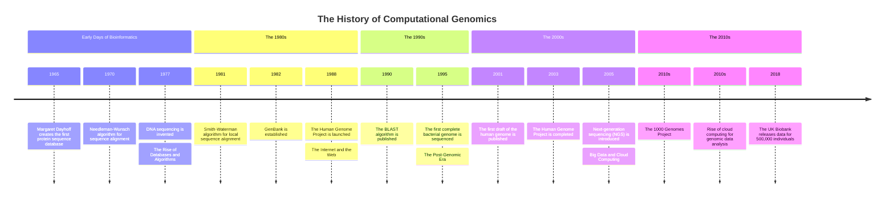

```mermaid
timeline
    title The History of Computational Genomics
    section Early Days of Bioinformatics
        1965 : Margaret Dayhoff creates the first protein sequence database
        1970 : Needleman-Wunsch algorithm for sequence alignment
        1977 : DNA sequencing is invented
    section The 1980s: The Rise of Databases and Algorithms
        1981 : Smith-Waterman algorithm for local sequence alignment
        1982 : GenBank is established
        1988 : The Human Genome Project is launched
    section The 1990s: The Internet and the Web
        1990 : The BLAST algorithm is published
        1995 : The first complete bacterial genome is sequenced
    section The 2000s: The Post-Genomic Era
        2001 : The first draft of the human genome is published
        2003 : The Human Genome Project is completed
        2005 : Next-generation sequencing (NGS) is introduced
    section The 2010s: Big Data and Cloud Computing
        2010s : The 1000 Genomes Project
        2010s : Rise of cloud computing for genomic data analysis
        2018 : The UK Biobank releases data for 500,000 individuals
```
