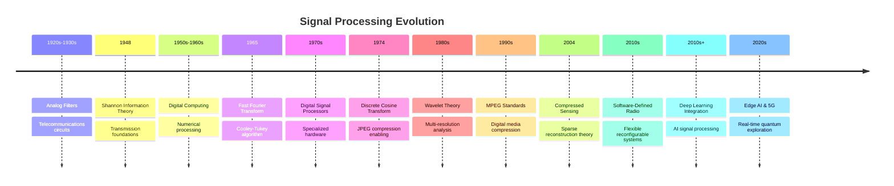

```mermaid
timeline
    title Signal Processing Evolution
    1920s-1930s : Analog Filters
                : Telecommunications circuits
    1948 : Shannon Information Theory
         : Transmission foundations
    1950s-1960s : Digital Computing
                : Numerical processing
    1965 : Fast Fourier Transform
         : Cooley-Tukey algorithm
    1970s : Digital Signal Processors
          : Specialized hardware
    1974 : Discrete Cosine Transform
         : JPEG compression enabling
    1980s : Wavelet Theory
          : Multi-resolution analysis
    1990s : MPEG Standards
          : Digital media compression
    2004 : Compressed Sensing
         : Sparse reconstruction theory
    2010s : Software-Defined Radio
          : Flexible reconfigurable systems
    2010s+ : Deep Learning Integration
           : AI signal processing
    2020s : Edge AI & 5G
          : Real-time quantum exploration
```
