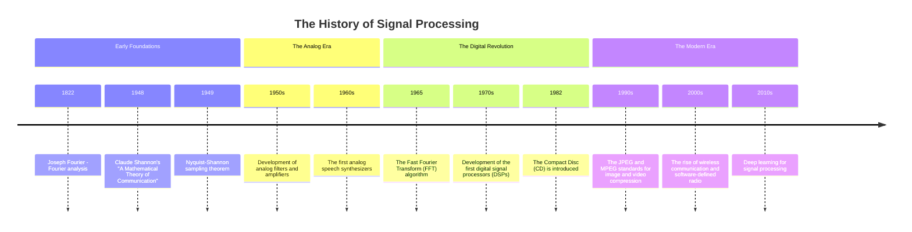

```mermaid
timeline
    title The History of Signal Processing
    section Early Foundations
        1822 : Joseph Fourier - Fourier analysis
        1948 : Claude Shannon's "A Mathematical Theory of Communication"
        1949 : Nyquist-Shannon sampling theorem
    section The Analog Era
        1950s : Development of analog filters and amplifiers
        1960s : The first analog speech synthesizers
    section The Digital Revolution
        1965 : The Fast Fourier Transform (FFT) algorithm
        1970s : Development of the first digital signal processors (DSPs)
        1982 : The Compact Disc (CD) is introduced
    section The Modern Era
        1990s : The JPEG and MPEG standards for image and video compression
        2000s : The rise of wireless communication and software-defined radio
        2010s : Deep learning for signal processing
```
