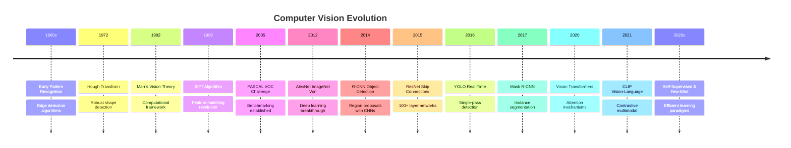

```mermaid
timeline
    title Computer Vision Evolution
    1960s : Early Pattern Recognition
          : Edge detection algorithms
    1972 : Hough Transform
         : Robust shape detection
    1982 : Marr's Vision Theory
         : Computational framework
    1999 : SIFT Algorithm
         : Feature matching revolution
    2005 : PASCAL VOC Challenge
         : Benchmarking established
    2012 : AlexNet ImageNet Win
         : Deep learning breakthrough
    2014 : R-CNN Object Detection
         : Region proposals with CNNs
    2015 : ResNet Skip Connections
         : 100+ layer networks
    2016 : YOLO Real-Time
         : Single-pass detection
    2017 : Mask R-CNN
         : Instance segmentation
    2020 : Vision Transformers
         : Attention mechanisms
    2021 : CLIP Vision-Language
         : Contrastive multimodal
    2020s : Self-Supervised & Few-Shot
          : Efficient learning paradigms
```
