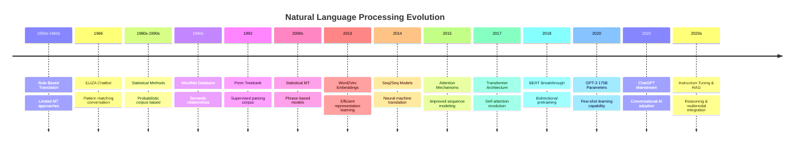

```mermaid
timeline
    title Natural Language Processing Evolution
    1950s-1960s : Rule-Based Translation
                : Limited MT approaches
    1966 : ELIZA Chatbot
         : Pattern matching conversation
    1980s-1990s : Statistical Methods
                : Probabilistic corpus-based
    1990s : WordNet Database
          : Semantic relationships
    1992 : Penn Treebank
         : Supervised parsing corpus
    2000s : Statistical MT
          : Phrase-based models
    2013 : Word2Vec Embeddings
         : Efficient representation learning
    2014 : Seq2Seq Models
         : Neural machine translation
    2015 : Attention Mechanisms
         : Improved sequence modeling
    2017 : Transformer Architecture
         : Self-attention revolution
    2018 : BERT Breakthrough
         : Bidirectional pretraining
    2020 : GPT-3 175B Parameters
         : Few-shot learning capability
    2022 : ChatGPT Mainstream
         : Conversational AI adoption
    2020s : Instruction Tuning & RAG
          : Reasoning & multimodal integration
```
