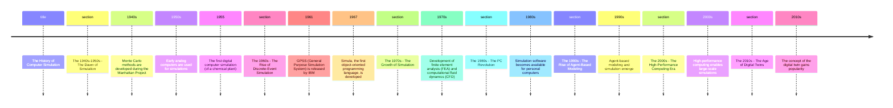

```mermaid
timeline
    title: The History of Computer Simulation
    section: The 1940s-1950s - The Dawn of Simulation
        1940s: Monte Carlo methods are developed during the Manhattan Project
        1950s: Early analog computers are used for simulations
        1955: The first digital computer simulation (of a chemical plant)
    section: The 1960s - The Rise of Discrete-Event Simulation
        1961: GPSS (General Purpose Simulation System) is released by IBM
        1967: Simula, the first object-oriented programming language, is developed
    section: The 1970s - The Growth of Simulation
        1970s: Development of finite element analysis (FEA) and computational fluid dynamics (CFD)
    section: The 1980s - The PC Revolution
        1980s: Simulation software becomes available for personal computers
    section: The 1990s - The Rise of Agent-Based Modeling
        1990s: Agent-based modeling and simulation emerge
    section: The 2000s - The High-Performance Computing Era
        2000s: High-performance computing enables large-scale simulations
    section: The 2010s - The Age of Digital Twins
        2010s: The concept of the digital twin gains popularity
```
