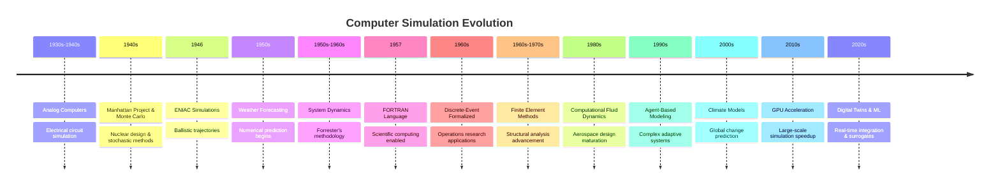

```mermaid
timeline
    title Computer Simulation Evolution
    1930s-1940s : Analog Computers
                : Electrical circuit simulation
    1940s : Manhattan Project & Monte Carlo
          : Nuclear design & stochastic methods
    1946 : ENIAC Simulations
         : Ballistic trajectories
    1950s : Weather Forecasting
          : Numerical prediction begins
    1950s-1960s : System Dynamics
                : Forrester's methodology
    1957 : FORTRAN Language
         : Scientific computing enabled
    1960s : Discrete-Event Formalized
          : Operations research applications
    1960s-1970s : Finite Element Methods
                : Structural analysis advancement
    1980s : Computational Fluid Dynamics
          : Aerospace design maturation
    1990s : Agent-Based Modeling
          : Complex adaptive systems
    2000s : Climate Models
          : Global change prediction
    2010s : GPU Acceleration
          : Large-scale simulation speedup
    2020s : Digital Twins & ML
          : Real-time integration & surrogates
```
